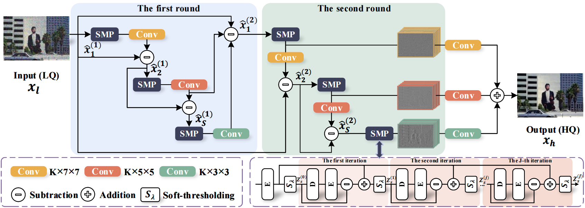

# MCSCNet: Revisiting Convolutional Sparse Coding for Image Denoising: From a Multi-scale Perspective 
- This is the official repository of the paper "Revisiting Convolutional Sparse Coding for Image Denoising: From a Multi-scale Perspective" from **IEEE Signal Processing Letters 2022**. [[Paper Link]](https://ieeexplore.ieee.org/abstract/document/9774926, "Paper Link")



## 1. Environment
- Python >= 3.5
- PyTorch == 1.7.1 is recommended
- opencv-python = =3.4.9.31
- tqdm
- scikit-image == 0.15.0
- scipy == 1.3.1 
- Matlab

## 2. Training and testing dataset
The training data is from the [[BSD500 dataset]](https://www2.eecs.berkeley.edu/Research/Projects/CS/vision/grouping/resources.html). The test data are from [[BSD500 dataset]](https://www2.eecs.berkeley.edu/Research/Projects/CS/vision/grouping/resources.html, "BSD68"), [[Urban100 dataset]](https://www.cv-foundation.org/openaccess/content_cvpr_2015/html/Huang_Single_Image_Super-Resolution_2015_CVPR_paper.html, "Urban100"),[[Kodak24 dataset]](http://r0k.us/graphics/kodak/, "Kodak24"),[[McMaster dataset]](https://www.spiedigitallibrary.org/journals/journal-of-electronic-imaging/volume-20/issue-2/023016/Color-demosaicking-by-local-directional-interpolation-and-nonlocal-adaptive-thresholding/10.1117/1.3600632.full?SSO=1, "McMaster") 
Or you can download the datasets from our [[Train Data]](https://drive.google.com/drive/folders/1vcRgZIi6bi6mvY6pXtiJXDAKQITHcxI6?usp=sharing., "Train Data"), [[Test Data]](https://drive.google.com/drive/folders/1XLDvAQNYo2fWY_cgcGpkuMV8Deon1XCD?usp=sharing., "Test Data").

## 3. Test
1. Clone this repository:
    ```
    git clone https://github.com/JingyiXu404/MCSCNet.git
    ```

step 2 and step 3 can be ignored if you only use BSD68\Urban100\Kodak24\McMaster datasets as testsets (Download from our [[Google Drive Link]](https://drive.google.com/drive/folders/1WCs-XR_pxAAsjfTz1cD_Yksrpk4YR-Il?usp=sharing.))

2. Generate `.npy` test datasets from original test data (follow the steps in dataset/test_data).

3. Place the high quality test images in `dataset/test_data/your_folder`. For example, `dataset/test_data/gt_BSD68` .
    ```
    dataset 
    └── test_data
        ├── gt_BSD68
        └── gt_Urban100
        └── other test datasets
    ```

4. Run the following command for single image denoising task with different noise_levels and different datasets:
    ```
    python test.py
    ```

Modify variables `dataset` (line 42 in test.py) and `noise_level` (line 43 in test.py) to test with different datasets (BSD68/Urban100/Kodak24/McMaster) and different noise_levels (10/15/25/30/50/70/75/90)

5. Finally, you can find the Denoised results in `./test_results`. Our results in the paper can be downloaded from [[Google Drive Link]](https://drive.google.com/drive/folders/1tq1G4-k196Q0chJOjf9WdIW6sv-1CsPb?usp=sharing.)

## 4. Citation
If you find our work useful in your research or publication, please cite our work:
```
@article{xu2022revisiting,
  title={Revisiting Convolutional Sparse Coding for Image Denoising: From a Multi-scale Perspective},
  author={Xu, Jingyi and Deng, Xin and Xu, Mai},
  journal={IEEE Signal Processing Letters},
  year={2022},
  publisher={IEEE}
}
```

## 5. Contact
If you have any question about our work or code, please email `jingyixu@buaa.edu.cn` .
